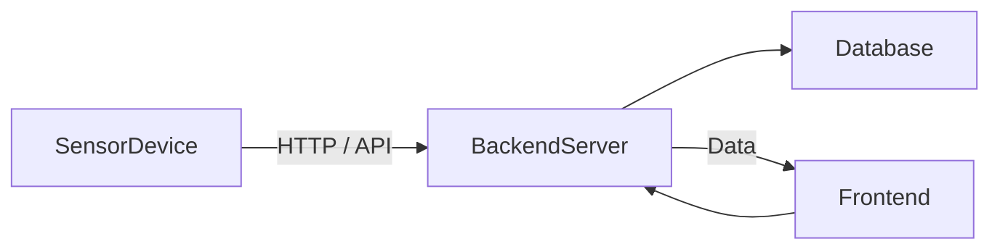

# 🌱 Smart Waste Management System

An *IoT + Web* solution that automates dustbin monitoring and smart waste collection.  
This system uses ultrasonic sensors and a web dashboard to monitor bin fill-levels, auto-open lids, and visualize data trends.

---

## 📘 Table of Contents

- [Project Overview](#1-project-overview)  
- [Key Features](#2-key-features)  
- [Architecture & Workflow](#3-architecture--workflow)  
- [Tech Stack](#4-tech-stack)  
- [Getting Started](#5-getting-started)
- [API Endpoints](#6-api-endpoints)
- [Directory Structure](#7-directory-structure)
- [Contribution](#8-contribution)

---

## 1. Project Overview

A combination of IOT and web application that serves three purposes:

a) Using ultrasonic sensors the dustbin opens on its own as soon as it detects anny human within its range

b) The filled percentage is sent to the web application

c) Comparison chart of last 7 days data for each dustbin

#### Potential users:

a) Parks and zoos

b) Universities

c) Hospitals

Future Scope : 

a) Addition of moisture sensors to distinguish between dry and wet waste

b) Addition of force sensor/ tilt sensor/ accelerometer to avoid sending incorrect data

Website Link : [https://iot-based-smart-waste-management.onrender.com/]()

---

## 2. Key Features

| Feature | Description |
|--------|-------------|
| Auto Lid Opening | Bin lid opens automatically when a human is detected nearby |
| Fill Level Reporting | Sensor sends percent filled to backend |
| Dashboard Visualization | View current and historical data for each bin |
| Multi-Bin Support | Supports multiple bins tracked independently |
| REST API | Server APIs for data ingestion, retrieval, and view rendering |
| Real-Time Updates | Live data reflected on the dashboard |

---

## 3. Architecture & Workflow

Here’s a high-level flow:

1. Ultrasonic sensors installed in each dustbin measure distance of waste level.
2. When a person comes near, a trigger opens the lid.
3. The sensor’s measured fill-level (percentage) is sent to the backend via HTTP (or MQTT, if extended).
4. Backend stores and processes data (e.g. last 7 days).
5. Frontend (web dashboard) fetches current and historical fill-levels and shows charts and comparisons.



---

## 4. Tech Stack

*Hardware:*
- Arduino / NodeMCU ESP8266 (for IoT data collection)
- Ultrasonic Sensor (for waste level detection)
- Servo Motor (for automatic lid mechanism)
- IR Sensor (for human detection)

*Software:*
- *Frontend:* HTML, CSS, JavaScript, Bootstrap, Chart.js  
- *Backend:* Node.js, Express.js  
- *Database:* MongoDB (NoSQL)  
- *Hosting:* Render (Web App), ThingSpeak (IoT Data Transmission)  

---

## 5. Getting Started

Follow these steps to set up the project locally:

### Prerequisites
- [Node.js](https://nodejs.org/) (v14+ recommended)
- [MongoDB](https://www.mongodb.com/try/download/community) installed locally or use [MongoDB Atlas](https://www.mongodb.com/atlas)
- Arduino IDE (for programming ESP8266/Arduino)

### Installation

1. *Clone the repository:*
   ```bash
   git clone https://github.com/kr254na/Smart-Waste-Management.git
   cd Smart-Waste-Management
   ```
2. *Install dependencies:*
   ```bash
   npm install
   ```

3. *Set up environment variables:*
   Create a .env file in the root directory and add:
   ```bash
   PORT=5000
   ```
   ```bash
   MONGO_URI=your_mongodb_connection_string
   ```
   Run the server:
   ```bash
   npm start
   ```

4. *Upload Arduino code:*

   a) Open iot/arduino/sketch.ino in Arduino IDE

   b) Configure WiFi SSID & Password

   c) Upload to ESP8266/Arduino

---

## 6. API Endpoints

| Method | Endpoint       | Description                       |
|--------|---------------|-----------------------------------|
| GET    | /api/bins      | Fetch status of all smart bins    |
| GET    | /api/bins/:id  | Fetch details of a specific bin   |
| POST   | /api/bins      | Add new bin data (IoT device input) |
| PUT    | /api/bins/:id  | Update bin information            |
| DELETE | /api/bins/:id  | Remove a bin record               |

**Example Request:**

  ```bash
  POST /api/bins
  {
    "location": "Block A",
    "fillLevel": 60,
    "lidStatus": "open"
  }
  ```

---

## 7. Directory Structure

```bash
Smart-Waste-Management/
├── backend/                 # Express.js backend
│   ├── models/              # Mongoose schemas
│   ├── routes/              # API routes
│   ├── controllers/         # Request handlers
│   └── server.js            # App entry point
├── frontend/                # Web interface
│   ├── assets/              # CSS, JS, images
│   ├── index.html           # Dashboard
│   └── charts.js            # Visualization scripts
├── iot/                     # IoT device code
│   └── arduino/             # ESP8266/Arduino sketches
├── .env.example             # Sample environment config
├── package.json             # Node.js dependencies
└── README.md                # Project documentation
```

---

## 8. Contribution

Feel free to fork this repo, raise issues, and submit pull requests!
